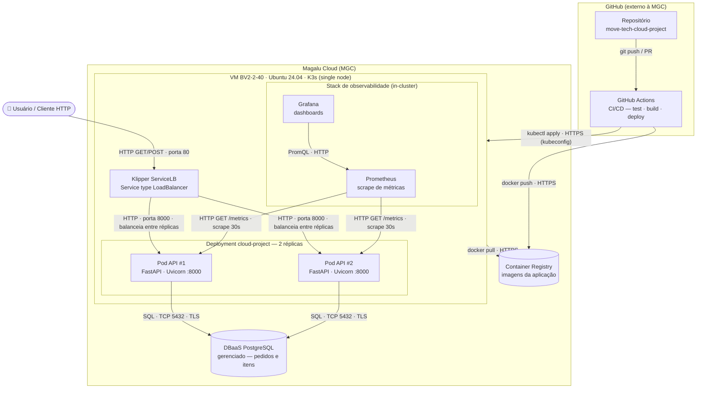

# Arquitetura da Solução — Move Tech Cloud Project

Documentação de arquitetura da **API de Pedidos** (micro e-commerce) implantada na
**Magalu Cloud (MGC)**. Este documento reúne o diagrama de componentes, a tabela de
componentes, os requisitos não-funcionais assumidos e o estilo arquitetural da solução.

> Escopo desta competência: documentação e análise. Não há código novo — o objetivo é
> registrar as decisões técnicas, os trade-offs e os próximos passos da arquitetura já
> construída ao longo do curso.

---

## Diagrama de arquitetura (C4 — nível 2, Contêineres)

O diagrama abaixo mostra os componentes da solução e como eles se relacionam. Cada seta
declara **o quê** trafega e **como** (protocolo). As fronteiras são desenhadas com
`subgraph`: a **Magalu Cloud** envolve tudo o que é provisionado no provedor; dentro dela,
a **VM (K3s)** envolve o cluster. O **banco** vive na MGC mas **fora da VM** (serviço
gerenciado), e o **GitHub** vive **fora da MGC**.

---

## Tabela de componentes

| Componente          | Serviço MGC                              | Função |
| ------------------- | ---------------------------------------- | ------ |
| API                 | K3s (VM single node) — 2 réplicas        | Processa as requisições HTTP (FastAPI + SQLAlchemy) |
| Banco de dados      | DBaaS PostgreSQL                         | Persiste pedidos e itens; sobrevive a reinícios de container |
| Imagens             | Container Registry                       | Armazena as versões versionadas da aplicação (Docker) |
| Tráfego externo     | Klipper ServiceLB (IP da VM, porta 80)   | Fornece acesso externo e distribui as requisições entre as réplicas |
| CI/CD               | GitHub Actions                           | Automatiza testes, build da imagem e deploy no cluster |
| Observabilidade     | Prometheus + Grafana (in-cluster)        | Coleta métricas (`/metrics`) via ServiceMonitor e exibe dashboards |

---

## Requisitos não-funcionais

Requisito sem número é opinião. Os alvos abaixo são as metas assumidas para a solução e a
forma de medi-los com a instrumentação já existente (`/metrics` no formato Prometheus,
probes do Kubernetes e Grafana).

| Requisito       | Como medir                                                        | Alvo |
| --------------- | ----------------------------------------------------------------- | ---- |
| Disponibilidade | Erros 5xx e uptime das probes (`/health`) no Grafana              | 99,5% mensal |
| Latência        | `histogram_quantile(0.95, ...)` sobre `http_request_duration_seconds` do `/metrics` | P95 < 500 ms |
| Escalabilidade  | Teste de carga [`load/k6/load-test.js`](../load/k6/load-test.js) + `rate(http_requests_total[1m])` | 300 req/s sem degradar |
| Custo           | VM + DBaaS + IP na calculadora MGC                                | Teto definido em ADR |

---

## Estilo arquitetural

A solução é um **monolito em camadas** (apresentação → serviço → dados), implantado como
**container único** replicado em **duas instâncias** (2 réplicas) atrás do balanceador:

- **Apresentação** — endpoints HTTP do FastAPI (`app/main.py`): validação de entrada com
  Pydantic e serialização das respostas.
- **Serviço** — regras de negócio dos pedidos e itens (criação, cancelamento, consulta),
  também em `app/main.py`.
- **Dados** — acesso via SQLAlchemy (`app/models.py`, `app/database.py`) ao PostgreSQL
  gerenciado.

A aplicação é **stateless**: nenhum estado de sessão vive no pod, o que permite escalar na
horizontal apenas adicionando réplicas atrás do balanceador. Todo o estado persistente fica
no DBaaS PostgreSQL, externo ao cluster.

**Estilo-alvo:** caso um domínio como o de **notificações** cresça a ponto de ter cadência
de deploy e escala próprias, o próximo passo seria **extrair um segundo serviço**,
evoluindo de monolito para uma arquitetura orientada a serviços — sem reescrever o núcleo
de pedidos.

---

## Recursos e escalonamento automático (HPA)

Os números abaixo saem diretamente dos manifests e são a base para o autoscaling e para o
teste de carga.

**Recursos por pod** ([`k8s/app.yaml`](../k8s/app.yaml)):

| | CPU | Memória |
| --- | --- | --- |
| `requests` | 100m | 128Mi |
| `limits` | 500m | 256Mi |

As `requests` são o que o scheduler reserva e a base que o HPA usa para calcular a
utilização; os `limits` protegem a VM (2 vCPU / 2 GB) de um pod consumir tudo.

**Autoscaler** ([`k8s/hpa.yaml`](../k8s/hpa.yaml)):

| Parâmetro | Valor |
| --- | --- |
| `minReplicas` | 2 |
| `maxReplicas` | 6 |
| Métrica-alvo | CPU 70% da `request` |

Com `requests.cpu = 100m` e alvo de 70%, cada pod escala ao passar de ~70m de CPU média.
O HPA depende do **metrics-server** (incluso no K3s) e é aplicado no deploy junto do
`app.yaml`.

> **Validação:** o teste de carga [`load/k6/load-test.js`](../load/k6/load-test.js) —
> executável pelo workflow **Teste de carga (k6)** ou localmente por
> [`run-load-test.sh`](../run-load-test.sh) — sobe uma carga em rampa (VUs configuráveis)
> exercitando os endpoints de pedidos e **falha se o P95 passar de 500 ms ou a taxa de erro
> passar de 1%**, exatamente os alvos da tabela de requisitos não-funcionais. O throughput
> alcançado (req/s) é reportado no resumo, para comparar com o alvo de 300 req/s.

---

## Trade-offs

Toda escolha técnica tem custos e benefícios. A tabela abaixo resume as principais
decisões, a alternativa que foi descartada e o critério que motivou a escolha. O raciocínio
completo de cada uma está nos [ADRs](adr/README.md).

| Aspecto | Decisão tomada | Alternativa não escolhida | Motivo da escolha |
| --- | --- | --- | --- |
| Deploy | K3s em VM | MKS (Kubernetes Gerenciado) | Custo menor, provisionamento < 2 min, manifests idênticos ([ADR 001](adr/001-kubernetes-deploy.md)) |
| Banco | DBaaS gerenciado | PostgreSQL em container | Backup automático, sem administração ([ADR 002](adr/002-dbaas-postgresql.md)) |
| Imagens | Container Registry MGC | Docker Hub / ghcr.io | Registry privado, mesma nuvem do cluster, sem limite de pull rate ([ADR 003](adr/003-container-registry.md)) |
| CI/CD | GitHub Actions | Deploy manual | Consistência e rastreabilidade ([ADR 004](adr/004-cicd-github-actions.md)) |
| Réplicas | 2 pods | 1 pod | Disponibilidade mínima sem custo excessivo |
| API | FastAPI (Python) | Node.js, Go, Java | Curva de aprendizado baixa, alta produtividade ([ADR 005](adr/005-fastapi-framework.md)) |
| Observabilidade | Prometheus + Grafana | APM SaaS / só logs | Padrão Kubernetes, open source, mede os requisitos não-funcionais ([ADR 006](adr/006-observabilidade-prometheus-grafana.md)) |

## Pontos de melhoria

Com base no que foi construído, esta seção registra o que pode evoluir na arquitetura —
tanto os próximos passos naturais quanto lacunas identificadas na implementação atual.

### Escalabilidade

A aplicação é **stateless**, então escala na horizontal — mais réplicas atrás do
balanceador. O **HPA (Horizontal Pod Autoscaler)** já está configurado
([`k8s/hpa.yaml`](../k8s/hpa.yaml)): ajusta as réplicas automaticamente pela utilização de
CPU (mínimo 2, máximo 6, alvo de 70%), apoiado nas `resources.requests` definidas no
Deployment. Os valores concretos estão na seção
[Recursos e escalonamento automático](#recursos-e-escalonamento-automático-hpa).

Vale registrar também que **mais réplicas não resolvem um gargalo de banco** — o PostgreSQL
escala na vertical e costuma saturar primeiro. Sob alta carga, o limite tende a ser o banco
(e o pool de conexões), não a API.

### Próximos passos naturais (do curso)

| Melhoria | Por quê | Status |
| --- | --- | --- |
| Autoscaler (HPA) | Escala automaticamente conforme a carga | ✅ Feito ([`k8s/hpa.yaml`](../k8s/hpa.yaml)) |
| Testes de carga (k6) | Valida o comportamento sob alto tráfego | ✅ Feito ([`load/k6/load-test.js`](../load/k6/load-test.js)) |
| HTTPS / TLS | Toda API em produção deve ser acessada por HTTPS | Pendente |
| Versionamento de API (`/v1/orders`) | Permite evoluir sem quebrar clientes existentes | Pendente |
| Rate limiting | Evita abuso e protege o banco de sobrecargas | Pendente |
| Cache (Redis) | Reduz consultas repetidas ao banco | Pendente |
| Migrações de schema (Alembic) | Controle de versão das mudanças no banco | Pendente |
| Migrar para MKS | Quando precisar de HA real: basta trocar o `kubeconfig` — os manifests YAML são idênticos | Pendente |

### Outros pontos de melhoria identificados no projeto

Além dos anteriores, os itens abaixo saíram da leitura direta do código e da infraestrutura
atuais:

| Melhoria | Contexto no projeto | Prioridade |
| --- | --- | --- |
| ~~**`resources.requests`/`limits` nos pods**~~ | ✅ Definidos em [`k8s/app.yaml`](../k8s/app.yaml) — habilitou o HPA e deu ao scheduler noção de capacidade | Feito |
| **Tags de imagem imutáveis** (`:sha-<git_sha>`) | O deploy usa `:latest` (mutável) — dificulta rollback e rastreabilidade (ver [ADR 003](adr/003-container-registry.md)) | Alta |
| **CD contínuo em `push`** | O workflow hoje dispara só por `workflow_dispatch` (manual); automatizar o deploy na branch principal aumenta a consistência (ver [ADR 004](adr/004-cicd-github-actions.md)) | Média |
| **Namespace dedicado** | Todos os recursos vivem em `default`; um namespace próprio isola e organiza o ambiente | Média |
| **Gestão de secrets** | O `db-secret` é criado inline no pipeline; considerar Sealed Secrets / Vault para não trafegar segredos via CI | Média |
| **Tracing distribuído (OpenTelemetry)** | A observabilidade atual tem métricas e logs, mas não *traces* — dificulta correlacionar requisições (ver [ADR 006](adr/006-observabilidade-prometheus-grafana.md)) | Baixa |
| **Persistência das métricas** | Prometheus guarda a série localmente na VM; a história se perde se a VM for recriada — usar armazenamento remoto/persistente | Baixa |
| **Alertas por SLO** | Já há métricas para os requisitos não-funcionais; falta configurar alertas (ex.: 5xx acima do orçamento de erro) no Alertmanager/Grafana | Baixa |
| **Pool de conexões e graceful shutdown** | Ajustar o pool do SQLAlchemy ao número de réplicas e tratar `SIGTERM` evita erros durante rollouts | Baixa |

### Custo estimado na Magalu Cloud

| Recurso | Especificação | Observação |
| --- | --- | --- |
| VM K3s | BV2-2-40 (2 vCPU, 2 GB) | Cobrada por hora de uso |
| DBaaS PostgreSQL | Instância pequena | Cobrado por hora de uso |
| Container Registry | Por armazenamento | Baixo para imagens < 500 MB |

> Consulte os preços atualizados em <https://magalu.cloud/precos/>.
